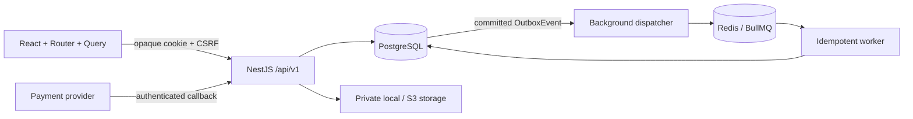
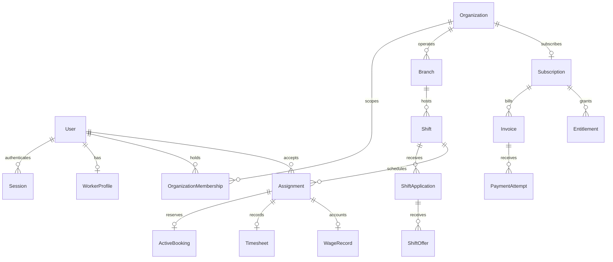

# Architecture

The repository is a pnpm workspace: `apps/web` is the React/Vite application, `apps/api` is the NestJS modular monolith, and `apps/jobs` is the independently started BullMQ consumer. Shared HTTP types are generated from Swagger into `packages/api-client`; Prisma stays server side.

## Boundaries

- Auth owns OTP challenges and revocable sessions. Authorization reloads membership and platform grants on every request.
- Organizations owns tenant membership, branches and roles. A worker profile is global and independent of organization membership.
- Shifts owns lifecycle and published capacity. Applications and offers capture mutual consent; only acceptance creates an assignment.
- Operations owns attendance events, timesheets, wage attestations, messages, notifications, verification and support.
- Billing owns immutable price snapshots, payment attempts, provider events and subscription entitlements. Worker wages are excluded from subscription revenue.
- Files owns private storage, content validation, quarantine and audited access. The storage provider does not decide business authorization.
- Developer endpoints are conditionally registered in non-production only. They cannot grant arbitrary platform privileges.

## Critical transactions

Acceptance locks shared resources before checking offer expiry, worker verification, skill eligibility, capacity and overlapping bookings. Assignment, offer/application transition, active booking and Outbox commit together. PostgreSQL `btree_gist` plus `tstzrange(...,'[)')` prevents overlap even between distinct organizations. Material shift terms cannot change after a worker confirms. Publish atomically consumes the subscription period's quota; cancellation does not refund quota.

Payment fulfillment preserves provider/environment/transaction identity and the subscription renewal sequence. The invoice and entitlement are fulfilled once. An independently received second payment must remain visible for reconciliation, without granting another period. Calendar-month arithmetic uses the persisted anchor day.

Attendance changes acquire the Shift row lock before the Assignment row lock, consume assignment-bound one-time tokens and use server time. Both worker and manager approvals are recorded. Wage calculation uses integer arithmetic and historical snapshots. Shift lifecycle transitions commit audit/outbox records in the same transaction; closing requires resolved attendance, approved timesheets and no open disputes, while wage acknowledgment remains independent.

## Event contract

An `OutboxEvent` carries an immutable UUID, `type`, `aggregateId`, optional `organizationId`, non-sensitive `payload`, unique `dedupeKey`, and dispatch metadata. Do not put session tokens, OTPs, private document contents or bank secrets into event payloads. Consumers must tolerate duplicate delivery. Reminder payload includes the scheduled start snapshot, which is rechecked along with assignment and shift status at delivery.

Potential future outgoing webhooks can consume the same contract, but external webhook delivery is not implemented or advertised in v1 settings.

## Scaling and migrations

Retain a single source of truth. Add indexes from measured query plans before adding search services. Keep unsupported SQL constraints in versioned migrations. Use expand/contract changes, a dedicated release migration job and old/new application compatibility during rollout. Never run reset or migrations independently in every replica.
